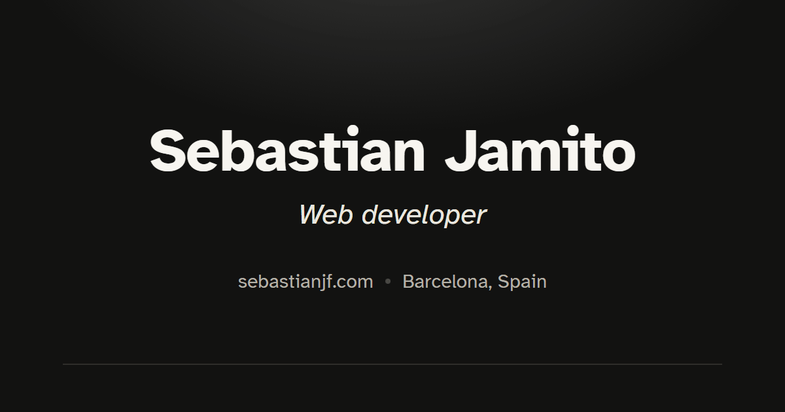

<div align="center">



# Portfolio

My personal site, in English and Spanish.

[**sebastianjf.com**](https://sebastianjf.com)


</div>

---

## Getting started

```bash
npm install
npm run dev
```

| Command           | What it does                         |
| :---------------- | :----------------------------------- |
| `npm run dev`     | Start the dev server                 |
| `npm run dev:host`| Start the dev server on the LAN      |
| `npm run build`   | Build the site into `dist/`          |
| `npm run preview` | Preview the build locally            |

## Structure

```text
src/
├── pages/      Pages (each one also exists under es/)
├── sections/   Header, About, Skills, Experience, Projects…
├── components/ Reusable pieces
├── consts/     Content: projects, experience, skills, awards
└── styles/     Global styles and design tokens
public/
└── locales/    UI strings for en and es
```

## License

[MIT](LICENSE) © seb
